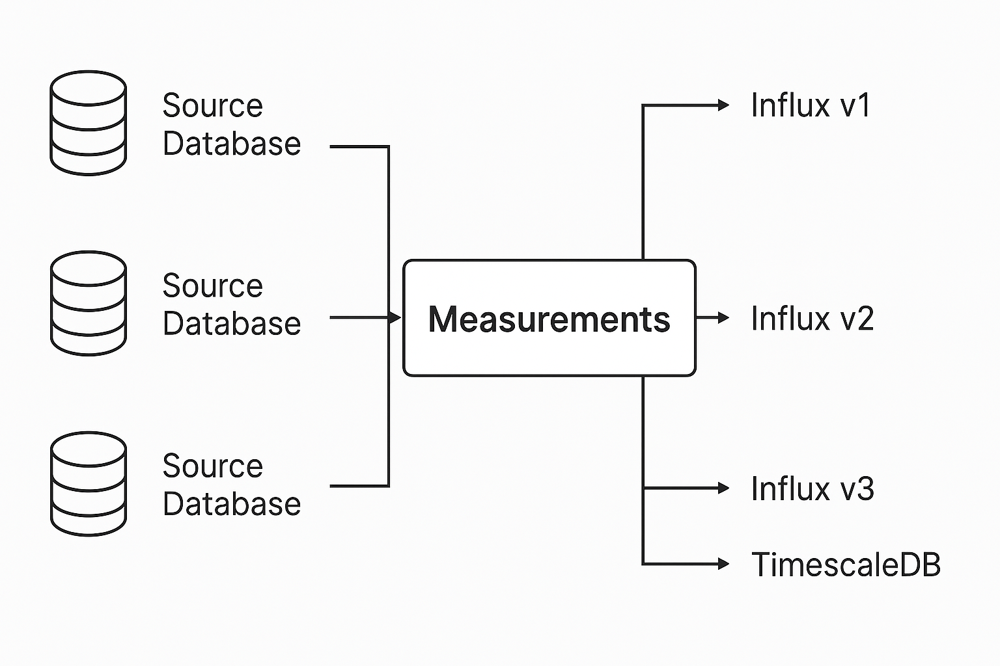

# pigflux

Query statistics from SQL databases, and send results to influxdb and other SQL databases.
You can configure multiple postgresql/mysql and influxdb instances.



## Build

For the impatient:

```
git clone git@github.com:nagylzs/pigflux.git
cd pigflux
go cmd/pigflux/pigflux.go
```

Please note that this will not include version information.

## Configuration

* Use the `-c`/`--config` or `--config-dir` command line option to specify configuration.  
* Use `pigflux --show-example-config` to print example configuration (`pigflux_example.yml`). 

Main configuration sections:

* **databases** - named configurations for various SQL database instances (PostgreSQL, MySQL, MS-SQL)
* **influxes** - named configurations for InfluxDb v1 instances
* **influxes2** - named configurations for InfluxDb v2 instances
* **influxes3** - named configurations for InfluxDb v3 instances
* **tests** - named configurations for test queries

Each test can contain the following values:

* **databases** - a list of database configuration names. The test will be run on the given databases. (
  You can run the same test on multiple databases)
* **influxes** - a list of influxdb v1 configuration names. Test results will be sent here.
* **influxes2** - a list of influxdb v2 configuration names. Test results will be sent here.
* **influxes3** - a list of influxdb v3 configuration names. Test results will be sent here.
* **target_databases** - a list of SQL databases, test results will be sent here. Target databases must have
  insert_sql configured!
* **measurement** - destination measurement name for the test
* **tags** - an object (key-value pairs) that will be used for tagging the measurement. Please note that InfluxDb
  supports string tag values only. The name of the database will be added as an extra tag called `database_name`. 
* **sql** - an SQL SELECT command that will be used to fetch measurement data from the PostgreSQL database. The result
   should have a single row, with a number of columns (see below)
* **fields** - a list of field names, columns with these names should have a floating point value, and their values will 
  be added to the measurement as such. All other columns in the result will be treated as dynamic tags, should have 
  textual data type, and will be added to the measurement.
* **order** - a number that will be used to determine the order of execution. When not given, it defaults to 1.
* **is_template** - When set, this test will not be executed, but it can be used as a template.
* **inherit_from** - name of another test that will be used to inherit almost all properties from. The is_template and
  inherit_from properties cannot be inherited.

Use `pigflux --show-example-config` to get an example configuration.

## Run

You can start pigflux from command line or cron:

    pigflux --config my_config.yml

Use `--help` for command line options.

## Run as a windows service

The easiest way to run pigflux is to use the [non-sucking service manager](https://nssm.cc/download).

* Download NSSM [from here](https://nssm.cc/download).
* Create a new service with `nssm.exe install pigflux`
